<!-- Typing SVG -->

  

---

##  About Me

Hi, I'm Julius. I believe the best way to understand something is to build it from scratch — that's how I learn, and that's how I work.

I'm a developer who enjoys digging into the low-level details of how things actually work. When I encounter a tool or a concept I don't fully understand, my first instinct isn't to read the documentation — it's to open an editor and start reimplementing it. Sometimes that means things take longer, but the understanding I gain is deeper and more durable.

**How I approach learning:**

I don't copy-paste solutions. When I hit a problem, I read the source, trace the execution, and build my own understanding. I fork interesting projects not to use them, but to study them — to take them apart, modify them, and see how each piece fits together. The process of rebuilding is where the real learning happens.

**What keeps me curious:**

- **Systems Programming** — C++ and Rust give me real control over memory and performance. I enjoy the challenge of writing code that's both efficient and correct, and the discipline it demands.
- **Emulation & Low-Level Architecture** — There's something deeply satisfying about understanding how a CPU actually executes instructions, how memory is mapped, how a PPU renders pixels. Emulators are my favorite way to learn computer architecture.
- **Simulation & Emergent Behavior** — Simple rules producing complex, beautiful patterns — flocking, particle systems, cellular automata. The math is elegant and the results are mesmerizing.
- **Developer Workflows** — I'm an Emacs enthusiast who believes your editor should be an extension of your thinking. I spend time customizing my tools because a well-tuned environment makes everything else faster.
- **AI & Agent Systems** — I'm interested in how agents can move from passive response to proactive interaction — predicting needs rather than waiting for commands.

---

##  Tech Stack

  

<b>🔧 More details</b>

 

| Category | Tools |
|----------|-------|
| **Languages** |      |
| **Tools** |     |
| **Editors** |    |

---

##  GitHub Stats

  

  

  

---

## 🏆 Trophies

  

---

## 🐍 Contribution Snake

<picture>
  <source media="(prefers-color-scheme: dark)" srcset="./profile/github-snake-dark.svg" />
  <source media="(prefers-color-scheme: light)" srcset="./profile/github-snake.svg" />
  
</picture>

---

  <i>"The best way to learn is to build. The best way to build is to understand."</i>

  

